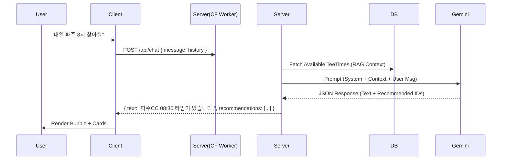

# Spec: AI Concierge (Chatbot)

## 1. Overview
사용자가 복잡한 필터(날짜, 지역, 가격 등)를 직접 조작하는 대신, 자연어로 원하는 골프 티타임을 요청하면 AI가 최적의 매물을 찾아 추천하고 예약을 도와주는 기능.

## 2. User Stories
| ID | User Story | Priority |
|----|------------|----------|
| US.3.1 | 사용자는 "이번 주말 수도권 20만원 이하 조인 찾아줘"라고 말할 수 있다. | P0 |
| US.3.2 | 사용자는 AI가 추천한 티타임 카드를 클릭하여 즉시 예약 상세 화면으로 이동할 수 있다. | P0 |
| US.3.3 | 사용자는 위약금 규정이나 날씨 등 부가 정보를 물어볼 수 있다. | P1 |
| US.3.4 | AI는 답변을 생성하는 동안 '입력 중(Typing)' 상태를 보여주어야 한다. | P1 |

## 3. UI/UX Requirements
### 3.1. AIChatDrawer (`components/AIChatDrawer.tsx`)
- **진입점**: 화면 하단 플로팅 버튼 (기존 구현됨).
- **Layout**:
    - Header: "안심 AI 매니저" 타이틀 + 닫기 버튼.
    - Message Area: 말풍선 리스트 (User: 우측, Model: 좌측).
    - Input Area: 텍스트 입력창 + 전송 버튼.
- **Components**:
    - `ChatMessageBubble`: 텍스트 메시지 표시.
    - `RecommendationCard`: 추천 티타임 요약 정보(골프장명, 시간, 가격)를 포함한 클릭 가능한 카드.

## 4. Technical Architecture


### 4.1. API Interface (`POST /api/chat`)
- **Request**:
    ```json
    {
      "message": "내일 파주 근처 조인",
      "history": [ ... ] // 이전 대화 컨텍스트
    }
    ```
- **Response**:
    ```json
    {
      "role": "model",
      "text": "파주CC 내일 오전 08:30 타임이 가장 적합합니다. 가격은 25만원입니다.",
      "recommendedTeeTimes": [ "uuid-1", "uuid-2" ] // 선택적
    }
    ```

### 4.2. Prompt Engineering Strategy
- **Role**: "당신은 10년 경력의 베테랑 골프 부킹 매니저 '안심이'입니다."
- **Constraint**: 
    - 친절하고 신뢰감 있는 말투 사용.
    - 주어진 `Context`(티타임 데이터) 내에서만 추천. 없는 매물을 지어내지 말 것(Halucination 방지).
    - 추천 시 반드시 티타임의 `ID`를 함께 반환할 것 (Function Calling 또는 JSON Mode 활용).

## 5. Development Tasks
1.  **Backend**: `functions/api/chat.ts` 구현 (Gemini SDK 연동).
2.  **Service**: `geminiService.ts` 내 프롬프트 구성 로직 작성.
3.  **Frontend**: `AIChatDrawer` 내 메시지 전송 및 카드 렌더링 로직 구현.
4.  **Testing**: 다양한 질의 유형에 대한 AI 응답 정확도 테스트.
