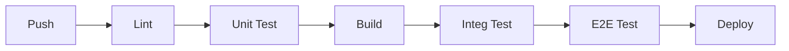

# Test Strategy: Ansim Golf

## 1. Overview
우리의 목표는 **"배포 후 수면 보장(Sleep-well at night)"**입니다. 이를 위해 다층적인 테스트 전략(Test Pyramid)을 운용하며, 특히 금융(에스크로)과 보안에 집중합니다.

## 2. Test Pyramid

### 2.1. Unit Tests (L1) - 60%
- **Target**: 유틸리티 함수, 비즈니스 로직(Hooks), Zod Schema, Reducers.
- **Tool**: Vitest.
- **Goal**: 빠른 피드백, 높은 커버리지 (>80%).
- **Rule**: 외부 의존성(Network/DB)은 100% Mocking.

### 2.2. Integration Tests (L2) - 30%
- **Target**: 컴포넌트 간 상호작용, 페이지 렌더링, API 핸들러(msw).
- **Tool**: React Testing Library, MSW (Mock Service Worker).
- **Goal**: 모듈 간 연결부 검증.
- **Rule**: 실제 브라우저 환경이 아닌 jsdom 환경에서 실행.

### 2.3. E2E Tests (L3) - 10%
- **Target**: 핵심 사용자 여정 (Critical User Journeys).
- **Tool**: Playwright.
- **Goal**: 실제 사용자 환경 시뮬레이션 및 배포 전 최종 검문.
- **Scenarios**:
    1.  **Booking Flow**: 검색 -> 상세 -> 에스크로 결제(Sandbox) -> 예약 확정.
    2.  **Manager Flow**: 텍스트 파싱 -> 인벤토리 등록 -> 수정.
    3.  **Chat Flow**: AI 챗봇 질의 -> 티타임 추천 카드 노출.

## 3. Security Testing (Non-Negotiable)
- **Static Analysis (SAST)**: ESLint Security Plugin, SonarQube (CI 단계).
- **Dependency Audit**: `npm audit` (매 빌드 시).
- **Secret Scanning**: Git Push 시 `.env` 또는 Key 패턴 감지.
- **Negative Testing**:
    - SQL Injection 시도 (입력값 검증 확인).
    - XSS 시도 (React 렌더링 이스케이프 확인).
    - 권한 없는 리소스 접근 시도 (401/403 확인).

## 4. Performance Testing
- **Lighthouse CI**: PR 생성 시 메인 페이지 LCP, CLS 측정.
- **Load Testing**: (Phase 5+) 주요 이벤트(특가 오픈) 전 k6로 부하 테스트.

## 5. CI Pipeline Integration

- **Blocking**: Unit/Integ 테스트 실패 시 Merge 불가.
- **Reporting**: 테스트 결과 및 커버리지 리포트 자동 생성.
